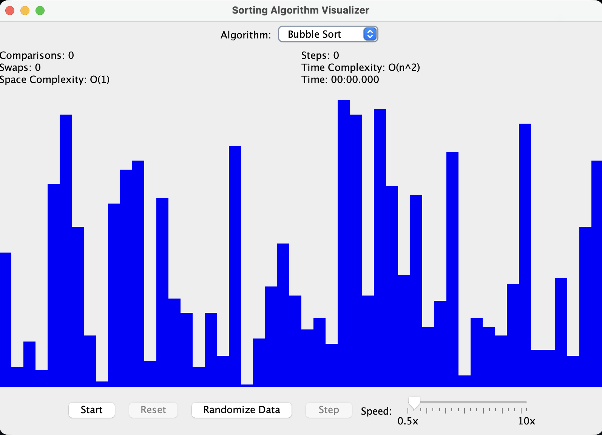
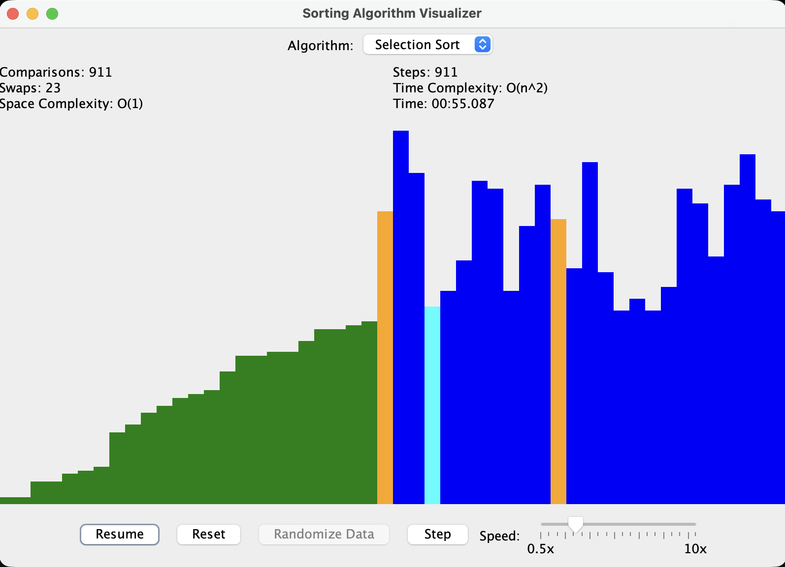

# Sorting Algorithm Visualizer

A Java Swing-based GUI application for visualizing and interacting with classic computer science sorting algorithms. Designed for education, demonstration, and experimentation.

## Features

- **Visualize** Bubble Sort, Selection Sort, Insertion Sort (more coming soon!)
- **Step-by-step execution**: Pause and step through algorithms interactively
- **Live statistics**: See comparisons, swaps, steps, and elapsed time (with speed multiplier)
- **Speed control**: Adjust the animation speed from 0.5x to 10x
- **Highlighting**: Watch comparisons, swaps, and sorted elements in real time
- **Randomize/reset**: Instantly generate new datasets and restart algorithms
- **Algorithm info**: See time and space complexity for each algorithm
- **.jar releases**: Download and run without building from source

## Getting Started

### Download

- Visit the [Releases](https://github.com/yourusername/SortingVisualizer/releases) page for the latest `.jar` files.
- Download the latest `SortingVisualizer-x.y.z.jar`.

### Run

```
java -jar SortingVisualizer-x.y.z.jar
```

Requires Java 17 or later.

### Build from Source

1. Clone the repository:
   ```
   git clone https://github.com/yourusername/SortingVisualizer.git
   cd SortingVisualizer
   ```
2. Build with Maven:
   ```
   mvn package
   ```
3. Run:
   ```
   java -jar target/SortingVisualizer-*.jar
   ```

## Usage

- **Select Algorithm**: Use the dropdown to choose a sorting algorithm.
- **Start**: Begin the visualization.
- **Pause/Resume**: Pause and resume at any time.
- **Step**: Step through the algorithm one operation at a time (when paused).
- **Reset**: Reset the algorithm and generate a new random dataset.
- **Randomize Data**: Shuffle the dataset without starting the algorithm.
- **Speed Slider**: Adjust the speed of the visualization.
- **Statistics Panel**: View live stats and algorithm complexity.

## Screenshots




## Algorithms Supported

- Bubble Sort
- Selection Sort
- Insertion Sort

More algorithms (Merge Sort, Quick Sort, Heap Sort, etc.) coming soon!

## Contributing

Pull requests are welcome! Please open an issue or discussion for major changes or new algorithm suggestions.

## License

MIT License. See [LICENSE](LICENSE) for details.

## Author

Karter Sanamo

---

**Download the latest .jar from the [Releases](https://github.com/yourusername/SortingVisualizer/releases) page and start visualizing algorithms instantly!**
